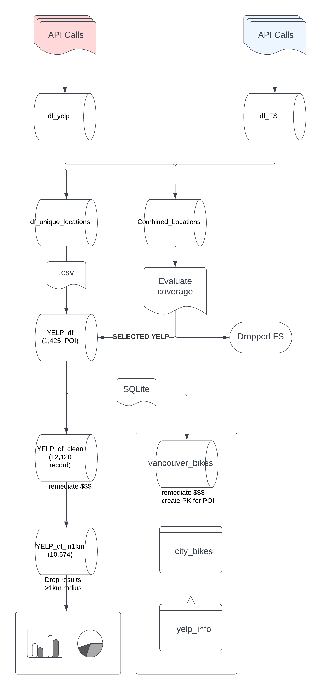
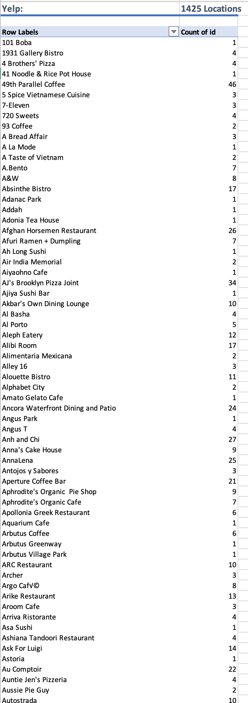
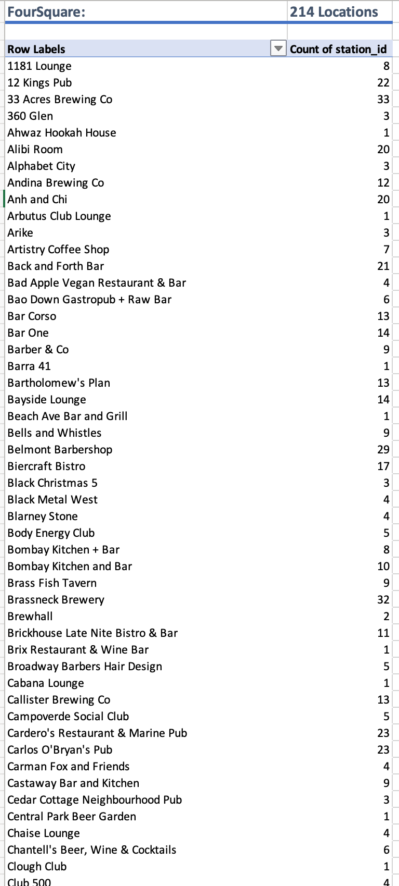
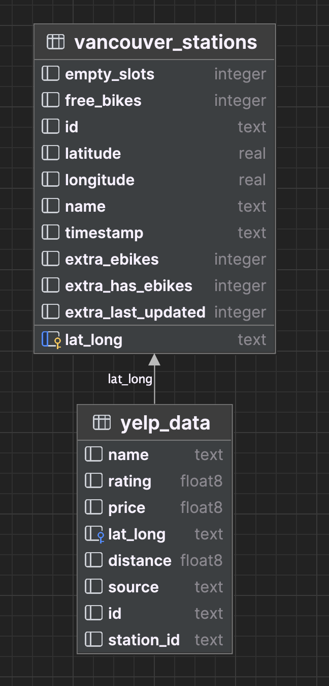
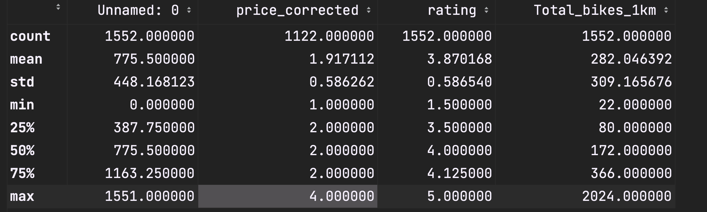
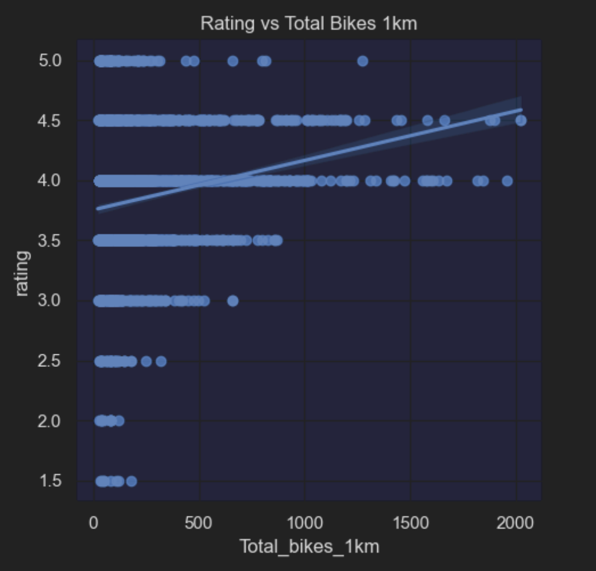
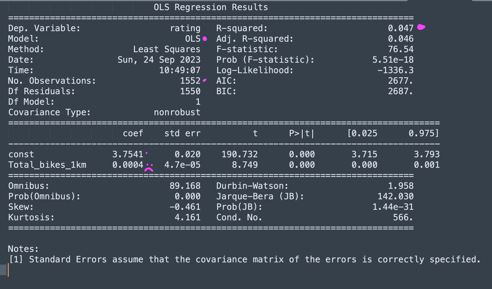

# Final-Project-Statistical-Modelling-with-Python

## Project/Goals
The overarching objective of this project was to perform and end-end data engineering activity, followed by statistical modelling to evaluate a hypothesis. 

**Goals included:** 
1. Developing API calls for City Bike to identify providers in a given location
2. Creating API calls  for two location-based information sources (Yelp, Foursquare) to obtain POI data
3. Incorporating results into a local database (Sqlite3)
4. Develop and test a hypothesis for relationship between POI and City Bike data 

## Process

### Data Engineering Overview:

### Step 1: Obtain detailed information about bike-share stations in Vancouver.
1. Obtain Master List of City Bike providers
Library required
2. Parse list to identify provider ID for Target City (vancouver)
3. Filter the list of network providers for one that is in the target city
4. Query City Bikes a second time to request detailed information for provider ('mobibikes')

> Details:  [01.city_bikes.ipynb](notebooks%2F01.city_bikes.ipynb)
> 
> Outcome: [city_bikes.csv](data%2Fcity_bikes.csv)

## Step 2: Create consolidated listing of POI data within a 1km radius of each Bike Station

The following steps were performed to obtain data from Foursquare. They were then repeated (revised as required) for Yelp. 
1. Create function takes lat/long and radius as arguments.
2. GET parameters include desired categories, and field information
3. API response (json) file is iterated to retrieve data (name, popularity, price etc)
4. data (dictionary) is appended to a list callled “FS_API_result”
5. List of lat/longs from CityBikes (vancouver_stations) is itererated.
6. Each lat/log in Vancouver_stations creates a new API call in the ‘foursquare’ function.
7. Results from each call (FS_API_Result) are in turn iterated and appended to the “All Results” list.
8. All_Results is a tidy dictionary that does not require json normalization.
9. DataFrame is created using All_Results dictionary.
10. DataFrame is dumped to json in ../data folder for future reference.
11. Compare depth/breadth of results between FS and Yelp.
12. Identify the Top 10 locations by Rating

> Details: [02.yelp_foursquare_EDA.ipynb](notebooks%2F02.yelp_foursquare_EDA.ipynb)

> Outcome: Yelp has broader coverage than Foursquare. FS was elminated from further analysis

| YELP                                                                                                                            | Foursquare                                                                                                                 |
|---------------------------------------------------------------------------------------------------------------------------------|----------------------------------------------------------------------------------------------------------------------------|
| 1,400 results.                                                                                                                  | 200 results                                                                                                                |
|  |  |

>   [FS_location_results.csv](data%2FFS_location_results.csv)\
>   [Yelp_location_results.csv](data%2FYelp_location_results.csv)

## Step 3: Migrate Data to SQLite Database.
1. Create connection function to "vancouver_bikes"
2. Define:
   3. "Create/Delete" functions to create tables, then insert records
   4. "Update" functions to insert Panda dataframe data into appropriate table.
   5. "Read" functions/queries 
3. Map data types from Pandas to Sqlite
4. Execute: 
   5. "Create/Delete" functions
   5. "Update" functions to insert data into DB.
   6. "Read" select query for use in hypothesis testing. 
6. Joins - create PK and FK in vancouver_bikes database
7. SQL View - Feature Engineering - remediate data elements for use in model (example: price $$ -> 2)

> Details: [03.joining_data.ipynb](notebooks%2F03.joining_data.ipynb)
> 
> Outcome:
> 
> 

## Step 4: Hypothesis Testing
1. Import data from either Sqlite directly or previously exported csv
2. Identify the X/Y variables (Y= Rating, X= count of bikes)
3. Plot a linear regression using sns. 
4. Obtain descriptive statistics for Bike_Date (min, max, std)
5. Establish a null, alternate hypothesis.
6. Input data into a Least Squares regression
6. Evaluate model output in terms of coefficients, R2, P-value. 
7. Accept/Reject the Null Hypothesis.

> Details: [04.model_building.ipynb](notebooks%2F04.model_building.ipynb)

> Outcome:
> > Descriptive Statistics:  
> 
> > 
> 
> >

## Results of Linear Regression Analysis:

### Relationship between RATING and TotalBikes

* H0: There is NO relationship between the number of bike within a 1km radius and a restaurant/bar's Rating
* H1: There is a relationship between number of bikes and the restaurant/bar rating.

**Interpretation**

Coefficient for Total_bikes_1km: 
* The coefficient value for 'Total_bikes_1km' is 0.0004 (ie the slope). 
* Implies that for every additional bike in the 1km radius, the rating is expected to increase by 0.0004, all else being equal.

Intercept (const): 
* The y-intercept or constant value is 3.7541. 
* An intercept of 3.7 means that even when the number of bikes within a 1km radius is 0, the predicted rating is 3.7541.

R-squared:
 * R2 value is 0.047. 
  * This indicates that only 4.7% of the variance in 'rating' is explained by the 'Total_bikes_1km
  * The R2 value is extremently low! which suggests 'Total_bikes_1km' might not be a strong predictor for 'rating'

T-score and p-value: 
* The t-score is >8, which is very large and correspondingly, the p-value is very small.
* The p-value associated with 'Total_bikes_1km' is very close to 0 (much less than 0.05).
 * This indicates that the relationship between 'rating' and 'Total_bikes_1km' is statistically significant at conventional significance levels.

**Conclusion**

As result of this linear regression model, we reject the null hypothesis. There appears to be a significant (alpha=0.05) between the number of bikes available within a 1km radius and the location rating. 

However, despite the finding, the count of total bikes is NOT a strong predictor for rating. This is supported by two observations: 
1. The y-intercept- 0 bikes available implies a rating of 3.75. Considering the scale only goes to 5, there is very little opportunity for bike count to contribute to higher ratings. 
2. The slope (coefficient) is  0.0004. For every increase in bike count, the rating increases by VERY little. Arguably, it is flat. 

## Challenges 

- [ ] Looping and consolidating API calls into a parseable dictionary.
- [ ] String vs Index of json normalization
- [ ] Connection string for Yelp.
- [ ] Determining the best primary key to link tables.
- [ ] Retaining enough data to keep POI 'distinct'

## Future Goals
If time permitted I would:
- Review the Yelp data for additional data points 
- Perform additional EDA on Yelp vs FS data
- Explore additional detail on the implications of distance to POI
